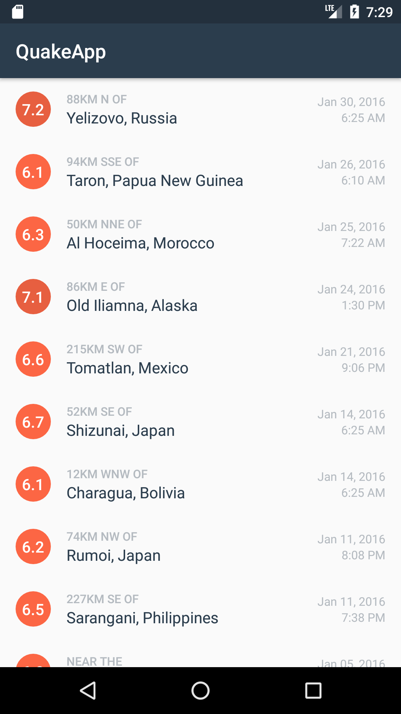

Quake App
===================================

This app displays a list of recent earthquakes in the world
from the U.S. Geological Survey (USGS) organization.

More info on the USGS Earthquake API available at:
https://earthquake.usgs.gov/fdsnws/event/1/

Demo
----

Pre-requisites
--------------

- Android SDK v28
- Android Build Tools "28.0.3"
- Android Support Repository v7:28.0.0'
- Gradle version gradle-5.4.1
